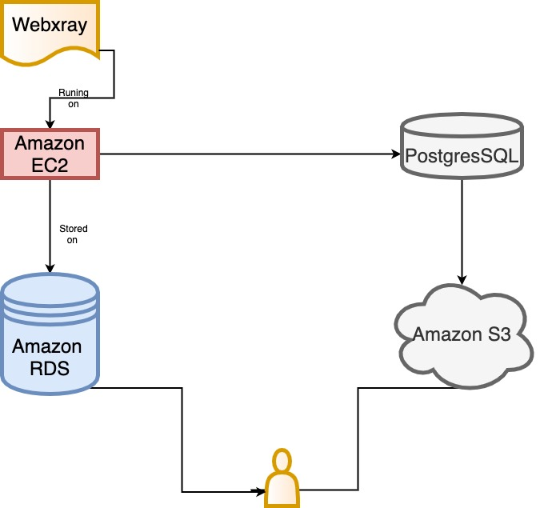

<!--
 * @Author: your name
 * @Date: 2021-03-29 20:14:44
 * @LastEditTime: 2021-11-03 11:36:21
 * @LastEditors: Please set LastEditors
 * @Description: In User Settings Edit
 * @FilePath: /webXray/README.md
-->
# WebXray

The project is forked by webxray project [https://webxray.org/](https://webxray.org/).

## Usage

The framework of the collecting process is:



### Website list
First, we need to know the websites list. Such as:

```
http://www.google.com
http://youtube.com
```
In this project, we use the [Alexa](https://www.alexa.com/topsites) to obtain the top 1000 websites for each country.

### Running environment

To runing the webxray dataset effectientlly, we need a high-performance computer. Amazon EC2 is a good choice. We need to rent a instance at Amazon platform. It is note that the dataset is stored in database format. To make a convenient access to the dataset, we rent a open Postgres database. 

- EC2 instance
We suggest that you use the ubuntu machine.

- Install google-chrome and google-chromedriver
You can find the instruction at [https://webxray.org/](https://webxray.org/)

- Install PostgreSQL
We suggest that you use the Postgresql because you can rent a open Postgresql database in Amazon and you can use it conveniently.

https://www.postgresql.org/download/linux/ubuntu/

Once you have installed the PostgreSQL, you can connect to a postgres instance:

```
sudo su - postgres

psql 
```

If you want to know the database name and its size in your machine. you can simply type:

```
\l+
```

### Collecting dataset
If you want to run this script to collect dataset, just type:

```
python3 run_webxray.py
```

If you want to collect dataset from all over the world. 

```
python3 run_webxray.py --auto_collect
```

If you want your scirpt running even though you exit the client.

```
setsid nohup python3 run_webxray.py --auto_collect > nohup.log 2>&1 &
```

# Dataset introduction

In this section, we want to give a detailed introduction about the webxray dataset. The dataset is stored as database format. We create a database for each country.

## Table

1. crawl_id_domain_lookup
In this table, there are several important columns. **crawl_id** means the websites we collect successfully. For example, as for the database wbxr_us_top_1000, there are 875 crawl_id in all, which means that some websites failed in our collecting process. **domain** is the tracking third party domain in this websites. **is_cookie** means that whether the third party domain is cookie or not.

2. domain_owner
**platforms** is the use platform of third party domain. **uses** is the aim of the doamin. **country** is the owner country of the domain.

3. cookie 
**page_id** is the website. **domain** is the third party domain embedded in this website. **name** is the cookie name of the third party domain.

4. page_id_domain_lookup
This table is the same as crawl_id_domain_lookup.

## Trackers in Webxray

What is the trackers in webxray dataset?. **Third party domain** can be seen as a rough tracker. **cookies** embedded in the **Third party domain** can be seen as a more meticulour domain.


